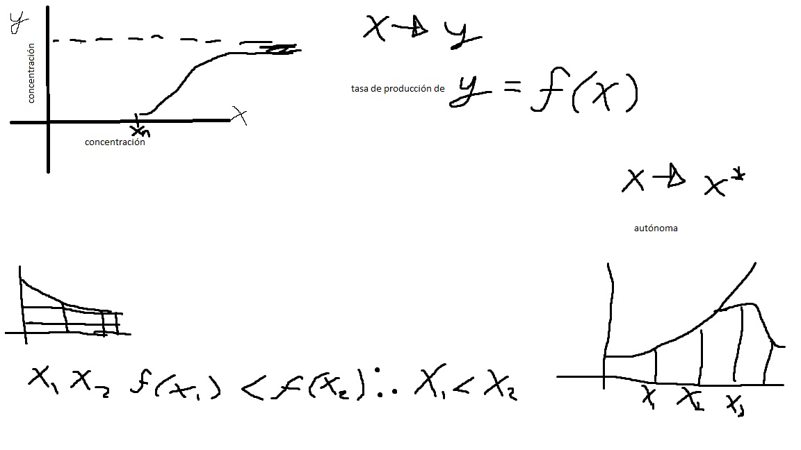
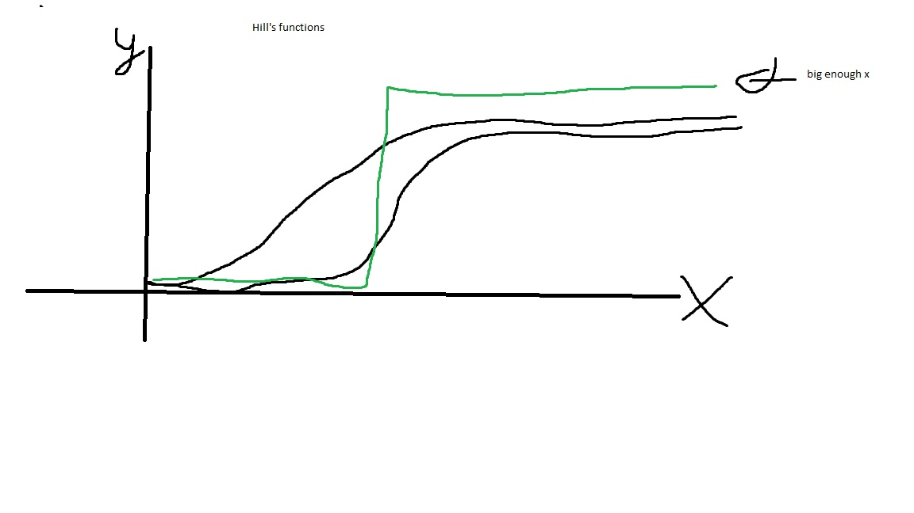
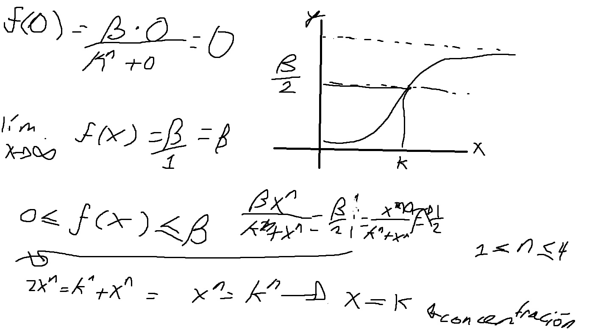

# Repaso de redes Booleanas

With network definition we can establish that it is a system interconnected nodes, that communicate and may interact with each other at times. We need a group and interaction for networks to exist. Networks may work connecting computers, proteins, people, etc. We have the vertex/nodes and the connections/edges $G=(V,E)$. The groups will be conformed by the nodes, while the edeges will make up the connections within said groups. We may have different types of individuals in each group and their relation within and among themselves can be of a varied range of classes. We must try to learn the nature of the connections of each node. 

Networks are ever growing in their applications and the fashion in which they are used for a myriad of subjects. At first, it was first know as graph theory what now is the network science, maturing from the mathematical fields as well as the computational field nowadays. We may find synonyms as nodes/vertex, links/edges and graphs/networks; they may be interchangeable but do have differences in certain aspects when speaking very specifically. 

We have directed and undirected networks, meaning the direction of the interaction may be significant or not in the regard of the direction. We have properties that appear in the networks. The degree is the number of neighbors each node has, how many connections it has; we may select if they are inward or outward. The average degree is a global characteristic of the average of the local property of the degree. The degree distribution refers to the distribution of the frequencies of the nodes' degree; we have the probability of each node to have a certain number of connections $P_K=\frac{P}{}$.

We can represent the networks via the use of an adjacency matrix, with 1's and 0's that represent either a connection or its absence. 

## Boolean networks

They are called Boolean because it is based on the Boolean algebra with truth tables and Boolean operators. We create the truth tables based on the Boolean rules we have set for our network. Based om the rules and the truth tables we may find attractors. We have to define the regulatory network model, recover dynamical behavior, explain the attractors, find new ones and demonstrate. We add a set of update rules, meaning we can update certain nodes with each time step in the network based on the state of other nodes and watch transitions through the time. The experimentally grounded network constitutes a regulatory mechanism driving the specification of the experimentally proved cellular phenotypes. We transform biology to a binary system.We can describe the boolean networks as follows $x_i(t + 1)= F_i(x_1(t),x_2(t),...x_n(t)), i=1,...,n$ . It changes with time, but we're interested in times when it doesn't change anymore, meaning the attractors. 

1. Define a Boolean gene regulatory network model.
2. Show how such model is computationally analyzed to recover its dynamical behavior.
3. Explain how the network attractor states are obtained and validated with experimental data.
4. Characterize the configurations of the 
5. 

### Components

1. A list of genes hypothesized to summarize the properties of interest in a developmental system and a prediction of how those properties change over time. The list of chosen genes define the state of the system.
2. A set of updating rules specifying in terms of logical propositions how the activity of each gene changes over time as a function of the current activity of all the involved genes. Thus, the updating rules fix the system's transitions.

### Paradigms

There are three paradigms for Boolean networks. Synchronous, Asynchronous, and Probabilistic. When referring to synchronous, the rules are updated at each step based on the conditions of all the nodes in the previous state. Asynchronous means some update at different rates, so that some are updated with the rules, but others are not; it can represent speed or perpetuity of expression of certain genes or a threshold that needs to be covered before inhibition or activation. It is more realistic but requires deeper understanding and knowledge of the network. Finally, probabilistic updates mean we have more than a given set of update rules for each node; we can have many rules for each node and we assign a probability of following each set of rules.

The three of them are useful in many ways, but they still have disadvantages. We must strive for an adequate balance of realism and a descriptive model. We have to start from an easier system and work towards a more complex system, if need be. We have to select the information and approach for what we're trying to answer. 

The attractor basin is the sum of all states that end with the attractor. For synchronous rules, the basin of attraction is defined by different states, meaning a state only represents one attractor, as it will only end in such a result. With asynchronous rules, the states may share different attractors and cannot be as easily detected. Different probabilities of states is observable in synchronous updates.

### Robustness

We are trying to make perturbations in a network to see the dynamic changes. We can  have perturbation of the operators, meaning the rules that update the system. We use Hamming distance as a way to measure, we count the differences between the successor states given the alterations we made. The idea is that a system is robust when the alterations yield a low or non-existent Hamming distance. The other perturbation is given by changing the regulation relationships between nodes, meaning which nodes regulates what. They are called perturbation of operators and perturbation of edges respectively. The graphic way of analyzing this is via the use 

#### Useful arguments

There also are some operators that can be quite useful that are not as usual as AND, OR, and NOT.

1. When we want many things to be true as a sequence of *&*, we may use `all(gene1, gene2, ...)`
2. The operator `any()` will execute if any of the rules comply.
3. `maj()` is used when the majority of rules do comply.
4. `sumlt()` we can make it as follow `sumlt(gen1,gen2,...gen7, 3)` will evaluate as true if at least the number of genes we stipulate as the final number in the rules do comply. In the example it will evaluate if at least 3 genes are True.
5. 

### Exercises BoolNet

`Boolnet` can be used for the use of the paradigms we previously discussed. In the header of the text file we need we must have at least:

targets, factors

And can be used also with probabilities:

targets, factors, probabilities

For this purpose we can write the networks in a text editor and then load it with the function `loadNetwork()` or write it directly with artifacts as follows. 

```{r}
library(BoolNet)

net_1 <- loadNetwork("network_ex_1")

net_1

# Make it in R
#sink("testNet.bn") name and address it will be created
#cat("targets, factors\n")
#cat("Gene1, !Gene2 | !Gene3\n")
#cat("Gene2, Gene3 & Gene4\n")
#cat("Gene3, Gene2 & !Gene1\n")
#cat("Gene4, 1\n") #over-expression
#sink()
```

We can have over-expressed genes that are always active or knocked-out that will not express no matter what. (1's and 0's respectively)

**1. Exercise with real network**

```{r}
net_2 <- loadNetwork("red_real_ex") # apparently it doesn't accept "-" i the gene names, wonder if it can accept with "." or any kind of notation
getAttractors(net_2)
plotNetworkWiring(net_2)
plotAttractors(getAttractors(net_2))

# getTransitionTable(getAttractors(net_2)) do not run, it takes time
# getBasinOfAttraction(getAttractors(net_2),1) same problem

net_3 <- loadNetwork("real_ex_2") # check differences with previous set of rules
plotAttractors(getAttractors(net_3))
```

There is a not so successful repository for systems biology known as SBML. We can access in order to download or upload data for us to work. It stands for Systems Biology Markup Language. We work with a certain language for it to be homogeneous; we can download a model from there with the help of `BoolNet`. We go to BioModels and can find different types of models, from ordinary differentiation equations to logical models.

```{r}
# net_4 <- loadSBML("RodriguezJorge_Merged_TCR_TLR5_Signalling_BooleanModel_15Jul2018.sbml") # missing info

net_4 <- loadSBML("MODEL1610060001_url.xml")
```

Loops vs. cycles: cycle follows directions and will take you to the starting point. In loops we cannot follow the direction and arrive at the starting point. Coherent loops regulate directly and indirectly in the same fashion the nodes, while an incoherent loops regulates with different "sign" the nodes.

# History and basis of Boolean networks

Stuart Kauffman is Boolean network's father, the baseline for work. He was the one who proposed the idea of Boolean networks in 1969, he was initially a medic and had interest for many disciplines. Important works from this man include "The Origin of Order". He wanted to understand cellular differentiation, understand how the specialization from cells work from a common base that all cells share. He proposed a network in which activation and inhibition of different genes may yield different phenotypes. Due to lack of knowledge available at his time, he proposed that the network's connections were random, but we know that it isn't the case. 

Elena Álvarez and Luis Mendoza applied for the first time the idea of obtaining attractors from a network of *Arabidopsis thaliana*, where they discovered that phenotypes matched with those predicted by their network. They demosntrated their model approached both things that were already known, and possibilities that were unknown.  More detailed networks then were created and the precision started to grew with perturbations applied to the networks.

Reka Albert and Barabasi were later on pillars of this models. Both have generated ideas and works that attractors obtained from the models are in accordance with phenotypes observed in nature. The idea is making models that can be as useful or more than the experiments by themselves. 

# Perturbation

We change the state given to our system, meaning the activation or inhibition of the network; we do not change the update rules. We compare the next states from the original state and from the one we perturbed. The idea is we construct given the perturbation, how it affects the behavior. We may have three outcomes, the perturbation amplifies, we get into the same outcome as the original or we destroy/kill the perturbation. We check for differences and compare. We get the total "sum" of differences form the original compared with the one with perturbation; if after a long time the difference is 0, it means it will get to the same state no matter what, but if there is difference, it means the perturbation is actually affecting the outcome. We make the comparisons after a long enough period of time, we may see if it yields different attractors or not. $\frac{1}{n}\sum_{i=1}^{n}|\sigma_n(t)-\hat{\sigma}_n(t)|$

The more regulators there are for each node, the bigger the perturbation. With one regulator, the network is ordered, meaning it will always end with the same outcome, but with two or more, we get chaos and can yield different outcomes, but it is not total chaos. Total order would not give flexibility, while too much chaos would not allow for stability required. 

# Ginsim

First of all, we need to download ginsim and have Javascript downloaded beforehand. 

# Plática María Esther

## Aplicaciones y trabajo de Mariana

Specialty with linfocytes CD4+ with dynamics on Boolean networks. Myeloid cells are innate. 
Vignette: tutorials basically. 

# Discrete models

As oppose to continuum models. Boolean networks are discrete in how time passes, as the updates, we do it in the units we deem necessary or more useful. It is also discrete in its states, as they are active or inactive, generally speaking; we have specific states. They are approximations from nature, not precise representations. We start from the most basic models and then we add layers for more complexity and a more accurate representation of what truly happens.

# Continuous models

Such as the ODEs we use for certain systems. We have a continuum of time, and therefore, we also have continuous data as results. So far we haven't taken into account certain factors such as spatial properties, homogeneity, heterogeneity, etc. for these considerations, we use partial differential equations; we integrate different options and can work with different dimensions. The parameters are a headache to obtain and are crucial for an kind of continuous models, so they can be an important element that may be missing and therefore can restrict its use. 

# From discrete to continuous

We start from a discrete set of elements, such as regulatory proteins acting upon specific genes. We also have environment signals that activate the transcription factors that in turn will regulate their specific genes. Obviously, the transcription factors will act on genes that will create proteins that will also act on the transcription factors. 

For  $\dot{y}=f(x)$, but only when the concentrations of $x$ are enough for an activation of $y$, it is a kind of threshold. The threshold value will set a minimum for the activation, but also has a limit, since the concentration of $y$ cannot be infinite, there are regulation limits, given by transcription factors, environment signals, saturation, etc. In this example we have as $x$ activating $y$.


We can use Hill's functions. They are monotonous growing functions (can decrease also). They are represented as $f(x)=\frac{\beta x^n}{K^n+x^n}$. It has three parameters, $\beta$, the $x$ is our activator concentration, $n$, which will define the curve's shape, and $k$, that is the threshold value for the activation based on the concentration. When the $x$ gets bigger, tending to infinite, it generates a step like function; it is clearer the bigger the value of $x$; this step like shape reaches almost immediately the saturation limit. 


Hill's activation function is $f(x)=\frac{\beta x^n}{K^n+x^n}$. When $x$ tends to a mathematical hypothetical value of infinite it can be described as follows $\frac{\beta \frac{x^n}{x^n}}{\frac{k^n}{x^n}+\frac{x^n}{x^n}}=f(x)$, so it is equal to $f(x)=\frac{\beta}{(\frac{k}{x})^n+1}$. When $x$ tend to infinite, the value of the fraction will be massive. When the limit tends to infinite, we will basically obtain this: $f(x)=\frac{\beta}{1}=\beta$; meaning $\beta$ will therefore be the threshold value. We can infer that the value of the function will be between 0 and $\beta$.

**Notas en cuaderno**

Solve numerically with package `deSolve`. We'll be solving auto-inhibition.

$$
\dot{x}=\frac{\beta k^n}{k^n+x^n}-\alpha x
$$
The $n$ must be $1\leq n \leq 4$
The $\beta$ must be $\beta >0$
The $k$ must be $0 \leq k \leq \beta$
The $\alpha$ must be $\alpha >0$

```{r}
library(deSolve)


## We define the function with the equations
auto_inh <- function(t, state, parameters) {
with(as.list(c(state, parameters)), { 
       # The list of equations
       dX <- ((beta*(k)^n)/((k^n)+(x^n)))-alpha*x
        list(c(dX))
      })
}
# Paramaters values
parameters <- c(k=1, alpha=5, n=1, beta=1)

# Initial conditions
state <- c(x=0)

# The time lapse we'll be using
times <- seq(0, 100, by = 0.01)

# we make the differential equation "ode"
out <- ode(y = state, times = times, func = auto_inh, parms = parameters)

# we graph
plot(out,col="blue")
    ## En 3-D
    library(scatterplot3d)

```

```{r}
# Functions for possible motifs

und_mot <- function(nodes, edges, reps, obs) {
  diags<-rep(0,reps)
  for (i in 1:length(diags)) {
    mat1 <- matrix(0, nrow = nodes, ncol = nodes)
    mat1[sample(nodes*nodes,edges)] <- 1
    diags[i] <- sum(diag(mat1))
  }
  m <- mean(diags)
  if(obs>m){
    k <- obs-m
    f <- k/sd(diags)
    print(paste("El valor observado corresponde a ",f,"desviaciones estándar respecto a lo esperado"))
  }else {
    print(paste("No parece ser un motivo"))
  }
}

dir_mot <- function(nodes, edges, reps, obs){
  diags<-rep(0,reps)
  for (i in 1:length(diags)) {
    mat1 <- matrix(0, nrow = nodes, ncol = nodes)
    mat1[sample(nodes*nodes,edges/2)] <- 1
    mat1[sample(nodes*nodes,edges/2)] <- -1
    # need to check the diagonal, maybe if to count negatives and positive separately
    diags[i] <- sum(diag(mat1))
  }
  m <- mean(diags)
  if(obs>m){
    k <- obs-m
    f <- k/sd(diags)
    print(paste("El avlor observado corresponde a ",f,"desviaciones estándar respecto a lo esperado"))
  }else {
    print(paste("No parece ser un motivo"))
  }
}


### Roberto 
# Este es un programa para generar redes aleatorias
# tipo Erdos-Renyi
# N número de nodos y k conectividades 
# 0 < k < N^2
# Contabilizar el número de auto regulaciones
#Generar n redes y calcular un promedio del número
# de auto-regulaciones
#n=424
#k=519

erdos_renyi_mia<-function(n_nodos,k, n_redes){
number_auto<-c()
for( i in 1:n_redes){
n_nodos<-10
#mat_ady<-matrix(rep(0,n_nodos*n_nodos),ncol=n_nodos)
mat_ady<-matrix(0,n_nodos,n_nodos)
k<-8

mat_ady[sample(n_nodos*n_nodos,k)]<-1

#Funciones útiles
# diag(), sum()

number_auto[i]<-sum(diag(mat_ady))


}
return(mean(number_auto))
}

```

# FFL (Feed forward loops)

## Feed forward loop coherent 1

```{r}
# Example with Boolean network

library(BoolNet)

net1 <- loadNetwork("feed_fwl_loop_net")
getAttractors(net1)
plotAttractors(getAttractors(net1))
plotStateGraph(getAttractors(net1))
plotNetworkWiring(net1)

```

```{r}
library(deSolve)

# Same set of rules, but with discrete approach and step functions 

# función escalón para el threshold
escalon <- function(x, threshold){
  ifelse(any(x<=threshold),return(0),return(1))
}

steps <- function(t, state, parameters) {
with(as.list(c(state, parameters)), { 
       dX <- 0
       escalon1 <- escalon(x,0.3)
       dY <- beta2*escalon1-alpha2*y
       escalon2 <- escalon(y,0.6)
       dZ <- escalon1*escalon2*beta3 #-alpha3*z
        list(c(dX, dY, dZ))
      })
}


parameters <- c(beta1=3, beta2=3, beta3=4, alpha1=1, alpha2=1, alpha3=2) # the faster the degradation of "z", it suddenly drops, even when smaller than the beta if we keep degradation of "z"

state <- c(x=0.01, y=0, z=0)

times <- seq(0, 100, by = 0.01)

out <- ode(y = state, times = times, func = steps, parms = parameters)

tail(out)

matplot(out[ , 1], out[ , 2:4], type = "l", xlab = "Tiempo", ylab = "Concentración",
main = "Concentraciones", lwd = 2,lty=1)
legend("topright", c("x","Y","Z"), col = 1:3,lty=1)

plot(out) # stability??
```

```{r}
library(deSolve)

# Approximation with use of Hill's equations

# First coherent loop, positive regulation

hill <- function(t, state, parameters) {
with(as.list(c(state, parameters)), { 
       dX <- 0
       dY <- (beta1*(x^n))/(k^n+x^n) - alpha2*y
       dZ <- ((beta1*(x^n))/(k^n+x^n))*((beta2*(y^n))/(k^n+y^n)) - alpha3*z
        list(c(dX, dY, dZ))
      })
}

parameters <- c(beta1=0.8, beta2=0.8, k=3, n=6, alpha1=1, alpha2=1, alpha3=0.4) 

state <- c(x=0.1, y=0, z=0)

times <- seq(0, 20, by = 0.01)

out <- ode(y = state, times = times, func = hill, parms = parameters)

tail(out)

matplot(out[ , 1], out[ , 2:4], type = "l", xlab = "Tiempo", ylab = "Concentración",
main = "Concentraciones", lwd = 2,lty=1)
legend("topright", c("x","Y","Z"), col = 1:3,lty=1)

plot(out)

```


## Coherent and incoherent

Check RegulonDB, it is the best curated database for E. coli's genes. 

```{r}
library(regutools)
```

We'll work with the bacteria E. coli and with the yeast S. cerevisiae. Firstly, the approach will be directly with the sites and then, we'll be using computational ways of accessing the information. 

```{r}
e_coli <- read.table("MotifsRegulatoryNetwork/MotifsRegulatoryNetwork/01_Raw_Data/1aorinter_st.txt", quote = "\t")
yeast <- read.table("MotifsRegulatoryNetwork/MotifsRegulatoryNetwork/01_Raw_Data/yeastinter_st.txt", quote = "\t")

table(e_coli$V3)
unique(e_coli$V3)

table(yeast$V3)
unique(yeast$V3)

# count autoregulation
cont <- 0
for (i in 1:nrow(e_coli)) {
  if(e_coli$V1[i]==e_coli$V2[i]){
    cont <- cont + 1
  }
}

cont # seems the autoregulations were excluded


mat_1 <- matrix(0, nrow(e_coli), nrow(e_coli))
for (i in 1:nrow(e_coli)) {
    matriz[e_coli$V1[i], e_coli$V2[i]] <- 1
    
}


```


BoolNet, Antelope, ginsim, gnbox, gna, biocham


get_regulatory_network(e_coli_regulondb, cytograph = FALSE)->net_ecoli_regulonDB
lista_adyacencia_e_coli<-as.data.frame(net_ecoli_regulonDB)
red<-graph_from_data_frame(lista_adyacencia_e_coli[,1:2])


